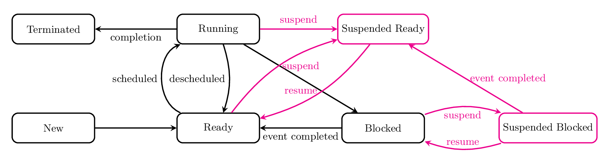

!!! tip "Process"

    A process is an instance of a program running on a computer.

    OS needs to keep track of information to represent a process:

    * **Memory** Program code, data, etc.
    * **Resources in use** I/O in use, physical memory, etc.
    * **Execution state** Register set, current process state, etc.

!!! tip "Address space"

    The process's view of it's memory, a range of memory locations:

    ```math
    \Vert\underset{\uparrow}{0}\Vert\text{[Text segment]} \quad \text{[Data segment]} \quad \text{[Heap]}\Rightarrow \quad \Leftarrow\text{[Stack]}\Vert\underset{\uparrow}{max}\Vert
    ```

    * **Text segment** Stores program code
    * **Data segment** Stores global / static vars
    * **Heap** Stores dynamically allocated memory
    * **Stack** Stores local vars and function call info

!!! tip "Process states"

    In the execution life cycle, the process moves through a series of states:

    

## Process control

!!! tip "Process control block (PCB)"

    The PCB (or *Process descriptor*) is a data structure used by the OS to represent a process. It contains:

    * Process ID (PID)
    * Process state
    * Program counter (address of next instruction)
    * Register context (snapshot of register contents when process was last in *running* state)
    * Scheduling information (e.g. process priority, pointers etc.)
    * etc.

!!! info "Process Table & Process List"

    * Table where OS keeps pointers to each process's PCB
    * When a process is completely terminated, OS removes process from process table and frees up all used resources
    * OS maintains a **Ready list** and a **Blocked list** that stores references to the PCBs of processes that are not running

## Process lifecycle

!!! info "Create process"

    How to create a new process:

    * A process spawns a new process
    * Forming a tree of processes with parent and child relationship

    Actions taken:

    * Assign unique PID
    * Allocate memory for process
    * Initialize PCB
    * Add process to *Ready list*

    System call: `fork()` creates a new process by duplicating the calling process. The child process gets a unique PID and a copy of the parent's address space.

    `exec()` replaces the current process's address space with a new program. It is often used after `fork()` to run a different program in the child process.

!!! info "Terminate process"

    * Self termination: `exit()` or return from main
    * Process may terminate in response to a **signal**, error or fault
    * Parent can obtain information from terminated child via `wait()`, `waitid()` or `waitpid()`
        * **Zombie process**: Any *terminated* process in this state is a zombie process
        * Child resources & PCB is **kept** until only **after** parent has collected information about the child
    * Any child processes will normally be kept alive and not terminated

!!! info "Suspend process"

    * Temporarily deactivate the process so it is not being considered for [processor scheduling](scheduling).
    * Suspension only happes externally:
        * Request by parent process
        * OS can suspend a **blocked** process to free up memory for another ready process
    * Must be resumed externally

    

## Signals
