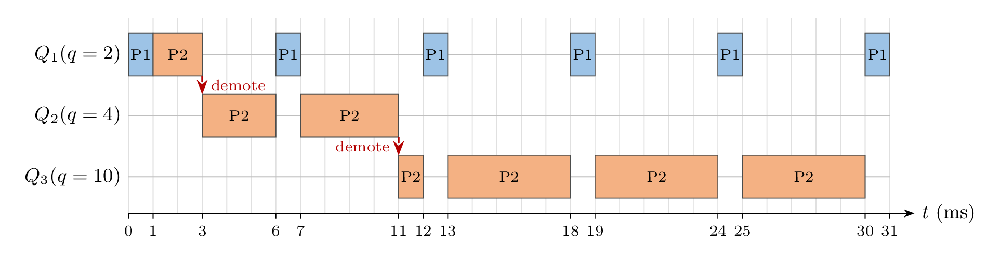
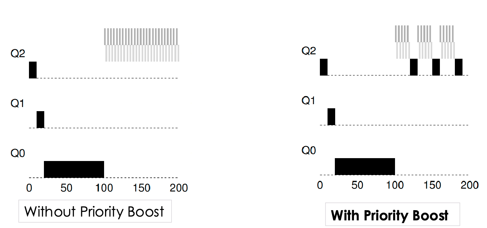

Act of selecting the next process/thread to run on the CPU.

## Terms

!!! tip "CPU-bound (compute-bound) process"

    When running, tends to use all the processor time allocated to it. It would go faster if the CPU were faster.

!!! tip "I/O-bound process"

    When running, tends to use the processor only briefly before generating an I/O request and relinquishing the processor. It would go faster if the I/O subsystem were faster.

!!! tip "Turnaround time"

    The amount of time to execute a particular process, from submission to complete servicing:

    ```math
    T_{\text{turnaround}} = T_{\text{completion}} - T_{\text{arrival}}
    ```

    The objective is to minimize turnaround time.

!!! tip "Waiting time"

    The amount of time a process waits in the ready queue.

!!! tip "Response time"

    The amount of time from when a process is submitted to the first time it is scheduled. This is an important performance metric for interactive tasks:

    ```math
    T_{\text{response}} = T_{\text{first run}} - T_{\text{arrival}}
    ```

    The objective is to minimize response time.

!!! tip "Throughput"

    The average number of processes (jobs) that complete their execution per unit of time. The objective is to maximize throughput.

!!! tip "Fairness"

    All similar processes (jobs) are treated the same. Even if processes are in different priority classes, no process should suffer indefinite postponement (starvation).

## Scheduling algorithms

!!! note "Evaluating scheduling algorithms"

    Use a table:

    | Process | Arrival time | CPU burst time |
    | --- | --- | --- |
    | A | 0 | 3 |
    | B | 2 | 6 |
    | C | 4 | 4 |
    | D | 6 | 5 |
    | E | 8 | 2 |

!!! note "First-In-First-Out (FIFO)"

    Dispatched according to arrival time.

    !!! eg "Example"

        Based on the above table:

        | Time | Queue | CPU |
        | --- | --- | --- |
        | 0--2 | -- | A |
        | 2--3 | B | A |
        | 3--4 | -- | B |
        | 4--6 | C | B |
        | 6--8 | C,D | B |
        | 8--9 | C,D,E | B |
        | 9--13 | D,E | C |
        | 13--18 | E | D |
        | 18--20 | -- | E |

        The completion times are $C_A=3$, $C_B=9$, $C_C=13$, $C_D=18$, and $C_E=20$. Therefore, the turnaround times are:

        ```math
        T_A=3,
        \quad T_B=9-2=7,
        \quad T_C=13-4=9,
        \quad T_D=18-6=12,
        \quad T_E=20-8=12.
        ```

        Hence, the average turnaround time is

        ```math
        \frac{3+7+9+12+12}{5} = 8.6.
        ```

!!! info "Shortest Job First (SJF)"

    Dispatched according to the shortest CPU burst time among the processes currently in the ready queue. SJF is non-preemptive, so a process runs to completion once it has been dispatched.

    !!! eg "Example"

        Based on the above table:

        | Time | Queue | CPU |
        | --- | --- | --- |
        | 0--2 | -- | A |
        | 2--3 | B | A |
        | 3--4 | -- | B |
        | 4--6 | C | B |
        | 6--8 | C,D | B |
        | 8--9 | C,D,E | B |
        | 9--11 | C,D | E |
        | 11--15 | D | C |
        | 15--20 | -- | D |

        The completion times are $C_A=3$, $C_B=9$, $C_C=15$, $C_D=20$, and $C_E=11$. Therefore, the turnaround times are:

        ```math
        T_A=3,
        \quad T_B=9-2=7,
        \quad T_C=15-4=11,
        \quad T_D=20-6=14,
        \quad T_E=11-8=3.
        ```

        Hence, the average turnaround time is

        ```math
        \frac{3+7+11+14+3}{5} = 7.6.
        ```

!!! info "Highest Response Ratio Next (HRRN)"

    Selects the ready process with the greatest response ratio:

    ```math
    R = \frac{W + S}{S} = 1 + \frac{W}{S},
    ```

    where $W$ is the waiting time and $S$ is the estimated CPU burst time. HRRN is non-preemptive and reduces starvation by increasing a process's priority as it waits.

    !!! eg "Example"

        For the example table, the schedule is

        ```math
        A\ (0\text{--}3),\quad B\ (3\text{--}9),\quad
        C\ (9\text{--}13),\quad E\ (13\text{--}15),\quad
        D\ (15\text{--}20).
        ```

        The turnaround times are $3,7,9,9,7$, respectively, giving an average turnaround time of

        ```math
        \frac{3+7+9+9+7}{5}=7.
        ```

## Preemptive scheduling

!!! note "Preemptive scheduling"

    Running processes may be interrupted and moved to the ready queue, allowing another process to run.

!!! info "Shortest Time-To-Completion First (STCF)"

    * *Preemptive* version of SJF
    * Arriving processes will trigger scheduler to check against the remaining running time to existing and new processes
    * Schedules the process with the shortest run-time-to-completion next

    !!! eg "Example"

        For the example table, the schedule is

        ```math
        A\ (0\text{--}3),\quad B\ (3\text{--}4),\quad
        C\ (4\text{--}8),\quad E\ (8\text{--}10),\quad
        B\ (10\text{--}15),\quad D\ (15\text{--}20).
        ```

        The turnaround times are $3,13,4,14,2$, respectively, giving an average turnaround time of

        ```math
        \frac{3+13+4+14+2}{5}=7.2.
        ```

!!! info "Round Robin (RR)"

    * *Preemptive*
    * Processes only run for a fixed **time quantum** (time slice)
    * Upon clock interrupt, if current process has its **quantum expires**, place to the end of the ready queue and schedule the next process in the ready queue

    !!! eg "Example"

        With a time quantum of $2$, the schedule for the example table is

        ```math
        A\ (0\text{--}2),\ B\ (2\text{--}4),\ A\ (4\text{--}5),\quad
        B\ (5\text{--}7),\ C\ (7\text{--}9),\ B\ (9\text{--}11),\quad
        D\ (11\text{--}13),\ E\ (13\text{--}15),\ C\ (15\text{--}17),\quad
        D\ (17\text{--}19),\ D\ (19\text{--}20).
        ```

        The turnaround times are $5,9,13,14,7$, respectively, giving an average turnaround time of

        ```math
        \frac{5+9+13+14+7}{5}=9.6.
        ```

## Priority scheduling

!!! note "Priority"

    A priority number assigned to a process. Can be static or dynamic.

!!! info "Multilevel feedback queues (MLFQ)"

    How it works:

    * Consists of a **number of queues** $Q_1\dots Q_n$ with priority $n$ and a time quantum $q_1\dots q_n$ for each queue
    * New job always enters at $Q_1$
    * Scheduler always selects a process from the **highest priority non-empty $Q$**
    * Within the same queue, processes are scheduled in a **round-robin** fashion
    * If a job at $Q_i$ uses an entire $q$ (or *<ColorBox color="teal">time allotment</ColorBox>*), it is **demoted** to $Q_{i+1}$, else, stay at same $Q_i$
    * <ColorBox color="blue">**Priority boost**</ColorBox>: *After some time period $S$, move all jobs in the system to $Q_1$*

    !!! eg "Example"

        Consider the following scenario in a single-CPU system with two processes, P1 and P2:

        * P1 is an interactive process that alternates between CPU and I/O bursts. It runs on the CPU for 1 ms, then performs I/O for 5 ms. This cycle repeats five times, followed by a final CPU burst of 1 ms. The total CPU time required by P1 is therefore 6 ms.
        * P2 is a CPU-bound process that runs continuously on the CPU for 30 ms without any I/O.
        * At $t = 0$, both P1 and P2 are ready and P1 is ahead of P2 in the queue.
        * No priority boost is applied in this scenario.

        

*Caveats of MLFQ:*

* <ColorBox color="blue">**Starvation**</ColorBox>: A process may never get CPU time if it is always preempted by higher-priority processes.

    For example, when a CPU-bound process is running, it may be preempted by a new interactive process that arrives in the system. If this happens repeatedly, the CPU-bound process may never get a chance to run. Solution: <ColorBox color="blue">**Priority boost**</ColorBox>

    

* <ColorBox color="teal">**Misbehaving processes**</ColorBox>: A process can end it's CPU burst right before $q$ to avoid being demoted. Solution: <ColorBox color="teal">**Time allotment**</ColorBox>

!!! note "Schedularing by fair share"

    Keep resource distribution even by considering the process's owner (mother process / user who initiated the process).

!!! info "Lottery scheduling"

    Probabilistic fair share scheduling:

    * Lottery **tickets** are distributed to processes, each ticket represents a chance to win the CPU
    * To keep fair, a process group/user is given a number of tickets proportional to the resources it is entitled to
    * When the scheduler runs, it randomly selects a ticket and the process holding that ticket is given the CPU
    * Lottery scheduling is **probabilistically fair**, meaning that over time, each process will receive CPU time proportional to the number of tickets it holds

!!! info "Stride scheduling"

    Deterministic fair share scheduling:

    * **Stride** = (some number n) / (tickets held by process)
    * Each process has a **pass value** that is initially set to 0.
    * CPU picks the process with the lowest pass value to run next.
    * After running, the process's pass value is incremented by its stride.

## Multiprocessor scheduling
