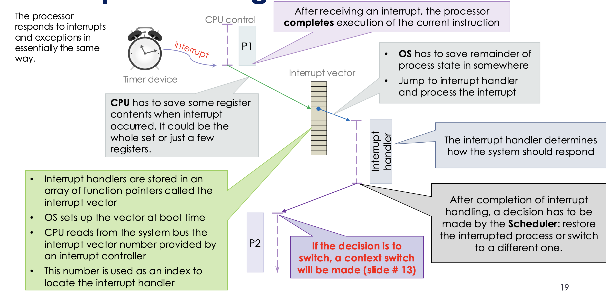
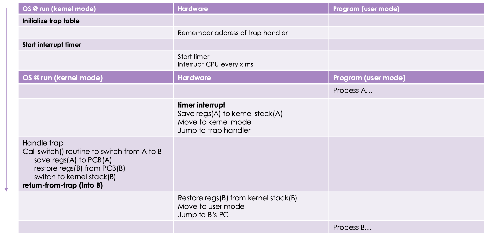

!!! tip "System calls"

    Used to request services from the kernel.

!!! tip "Virtualization"

    Allow each process to share the same CPU via time sharing, provide each process with it's own *virtual* CPU.

* Transparently & temporarily switch (stop / resume) between processes $\rightarrow$ **Context switching**
* Allow OS to regain control of the CPU

## Switching processes

!!! tip "The context"

    The context of a process is the information that the kernel needs to manage the process. It includes:

    * CPU registers
    * Memory management information
    * I/O status information

!!! info "Context switching"

    Switch from one process to another. The kernel would:

    1. suspend the progression of current process and stores its context
    2. retrieve the context of another process (B) and restores it to the CPU
    3. resume execution of process B

!!! note "Context switching overhead"

    * Context switching is expensive
    * The kernel must save and restore the context of processes
    * The kernel must also switch memory maps (page tables) when switching between processes

!!! note "Transparent virtualization"

!!! info "Mode switch vs. Context switch"

    Mode switch:

    * Switching from user mode to kernel mode
    * the Kernel is said to be "executing on behalf of the process"
    * the process's context remains accessible (e.g., address space)
    * upon exiting kernel, the process may resume and return to execute in user space

    Context switch will lead to a mode switch, but a mode switch does not necessarily lead to a context switch

## To regain control of the CPU

We need to regain control of the CPU from user processes when something goes wrong.

!!! note "Exceptions"

    * Interrupts triggered by a running process
    * Unexpected events **within** the processor

!!! tip "Timer interrupts"

    * Triggered by hardware device
    * OS to respond to alerts from hardware

!!! info "Handling interrupts"

    

    

... TBC
