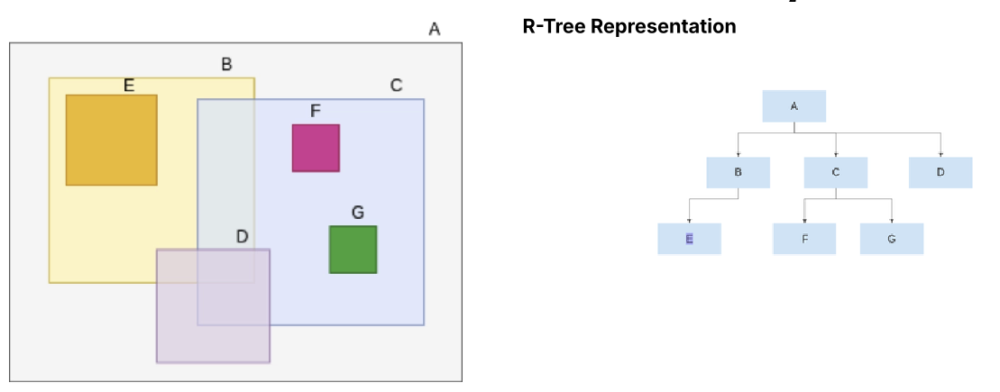

Traditional relational DBs cannot natively support complex operations over huge amount of spatial data. Spatial databases are designed to store and query spatial data efficiently.

## Spatial relationships

!!! note "Objects"

    Each object is represented by a (finite or infinite) set of points

    * boundary: set of points that are on the edge of the object
    * interior: set of points that are inside the object. Some objects (e.g. points, lines) do not have an interior.

!!! note "Topological relationships"

    Defined by a set of (set-based) relationships between their boundaries and interiors.

    The following are the hierarchy of topological relationships between two objects:

    ```mermaid
    graph TD
        ANY --> intersects
        ANY --> disjoint
        intersects --> adjacent
        intersects --> contains
        intersects --> inside
        intersects --> equals
    ```

!!! note "Distance relationships"

    Defined by the distance between the objects.

!!! note "Directional relationships"

    Defined by the relative position of the objects.

The relationships can be combined. For example: "My house is <ColorBox color="red">**disjoint**</ColorBox> from the park, <ColorBox color="blue">**100 meters**</ColorBox> <ColorBox color="purple">**north of**</ColorBox> it."

## Queries

Queries on spatial relationships.

!!! note "Minimum bounding rectangle (MBR)"

    The smallest rectangle that contains the object.

!!! info "Two-step spatial query processing"

    * Approximate objects by MBR
    * **Filter**: Test against the query predicate
    * **Refine**: Test the actual objects against the query predicate

## Spatial access methods

It is difficult to index spatial data - no dynamic access methods with good theoretical worse-case performance guarantees.

Therefore, **Spatial Access Methods (SAMs)** are used to minimize the expected cost.

### Evolution

Point access methods...

TBC...

## R trees

They're conceptually similar to B+ trees, but for spatial data.

!!! tip "R tree"

    A tree where:

    * Non-leaf nodes correspond to a MBR that contains all MBRs in its child nodes.
    * Leaf nodes contain the actual MBRs (or points) of the objects.
    * Unlike B+ trees, the MBRs of the child nodes of a non-leaf node may overlap. When searching for an object, we may have to traverse multiple paths down the tree.

    

!!! tip "R* tree"

    R*-trees aim to minimise overlap and dead space, making searches more efficient. Their main design objectives are:

    1. **Minimise the area of node MBRs:** reduce dead space, lowering the chance that a query intersects an MBR unnecessarily.
    2. **Minimise overlap between node MBRs:** reduce the number of paths that must be traversed during a search.
    3. **Minimise margins:** square-like MBRs are generally better for queries than long, narrow ones.
    4. **Maximise node storage utilisation:** reduce the height of the tree.

**Choosing a leaf for insertion.** At directory levels, choose the child whose MBR requires the least area enlargement to include the new object. At the leaf level, choose the child whose MBR causes the minimum increase in overlap with its siblings.

**Node splitting.** Node splitting occurs when a node overflows:

1. **Determine the split axis.** For both the $x$ and $y$ axes, sort the entries and evaluate different groupings. Choose the axis that minimises the sum of the margins of the two resulting MBRs.
2. **Choose the split index.** Along the chosen axis, choose the distribution with the minimum overlap.
3. **Forced reinsertion.** When a node overflows, remove a percentage of the entries farthest from the node's centre and reinsert them into the tree. These are the entries that are likely to produce a better-structured tree when reinserted.

!!! info "Bulk-loading"

    Bulk-loading is used to build an R-tree from a static dataset more efficiently.

    1. **Native $(x/y)$ sorting:** sort by one coordinate and pack consecutive objects into leaf nodes. This can create ``striped'' MBRs with high overlap.
    2. **Hilbert sorting:** sort using Hilbert curve values, which can improve the structure of the tree.
    3. **Sort-Tile-Recursive:** first sort all rectangles by their $x$-coordinate and divide them into vertical slices. Then, for each slice, sort by $y$-coordinate and pack the rectangles into leaf nodes.

## Spatial joins

### R-tree Join (Synchronized Traversal)

**Core observation.** If two directory nodes, $n_R$ and $n_S$, have MBRs that do not intersect, then no object in the subtree of $n_R$ can intersect any object in the subtree of $n_S$.

The algorithm recursively traverses both trees in parallel, then only considers pairs of entries whose MBRs intersect.

### Optimizations for Pair Comparison

Within two nodes, naive nested loops require $O(N\cdot M)$ comparisons. Plane sweep is used to improve this cost and find all intersecting entry pairs:

1. Sort the entries in both nodes by their $x$-coordinate.
2. Sweep a vertical line through the space, maintaining a set of active entries.

This reduces the number of comparisons. The cost is

```math
O\left((N+M)\log(\max(N,M))+k\right),
```

where $k$ is the number of intersecting pairs.

### Single-Index and No-Index Methods

1. **Indexed Nested Loops Join** is used when only one relation is indexed. For every object in the non-indexed set, its MBR is used as a window query on the indexed R-tree.
2. **Spatial Hash Join** is used when neither relation is indexed. It partitions the space into tiles and hashes objects into them to reduce the number of pairwise comparisons.

### Multi-Step Refinement for Joins

The join algorithms are part of the filter step. They produce candidate pairs of objects whose MBRs intersect.

1. **Geometric filter:** Use a more detailed but still efficient approximation to eliminate more false positives.
2. **Refinement:** For the remaining pairs, use the exact, computationally expensive geometry to determine the final result.
